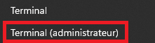
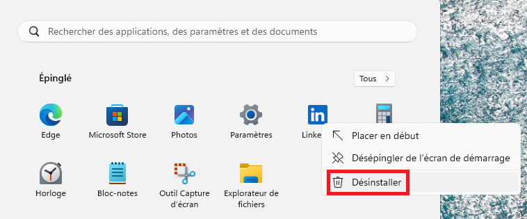

# Windows Cleanup Script

Ce script PowerShell permet de faire un nettoyage des applications préinstallées après une installation fraîche de Windows. Il est particulièrement utile pour les utilisateurs soucieux d'avoir seulement les applications qu'ils souhaitent sur leur système d'exploitation et d'avoir une installation plus légère et personnalisée de Windows.

## Quand exécuter ce script ?

Ce script doit être exécuté **directement après une nouvelle installation de Windows** ou après une réinitialisation du système. Il est recommandé de l'exécuter avant d'installer d'autres logiciels ou de configurer des paramètres personnalisés.

## Prérequis

- **Administrateur** : Vous devez être administrateur de votre machine pour exécuter ce script.
- **Connexion Internet** : Vous devez avoir une connexion internet avant de lancer le script pour qu'il soit fonctionnel.


## Instructions

**Ouvrir PowerShell en tant qu'administrateur** :
   - Cliquez avec le bouton droit sur le menu Démarrer et sélectionnez **Terminal (administrateur)**.  



### Méthode 1 : Git Clone
   - Dans votre powershell, taper la commande suivante pour récupérer le projet sur votre machine.   
```powershell
git clone https://github.com/AureDM/Windows_Cleanup.git
```

- Déplacez vous dans le dossier du projet
```powershell
cd .\Windows_Cleanup\
```

- Executer le script
```powershell
PowerShell -ExecutionPolicy Unrestricted -File ".\windows_cleanup.ps1"
```

### Méthode 2 : Télécharger le fichier
- Sur Git Hub, cliquer sur le script **windows_cleanup.ps1**
- Télécharger le fichier :  

- Déplacez vous à l'endroit où le fichier s'est téléchargé, probablement dans **Téléchargements** :
```powershell
cd .\Downloads\
```
- Executer le script
```powershell
PowerShell -ExecutionPolicy Unrestricted -File ".\windows_cleanup.ps1"
```

### Méthode 3 : Copier/Coller le script dans un fichier 
- Sur Git Hub, cliquer sur le script **windows_cleanup.ps1**
- Copier le fichier :  

- Sur votre machine, créer un fichier ps1 :
```powershell
notepad.exe windows_cleanup.ps1
```
- Coller le fichier
- Executer le script
```powershell
PowerShell -ExecutionPolicy Unrestricted -File ".\windows_cleanup.ps1"
```

## Applications désinstallées

- Obtenir de l'aide
- Power Automate
- DevHome
- Feedback Hub
- News
- Météo
- Office Hub
- Solitaire
- Enregistreur vocal
- Phone Link
- Assistance rapide
- Copilot
- Paint
- Microsoft Family
- Microsoft Clipchamp
- Microsoft Recherche Bing
- Microsoft Teams
- Microsoft To Do
- Microsoft Outlook
- Appareils mobiles
- Xbox Gaming App
- Xbox Speech-to-Text Overlay
- Xbox Identity Provider
- Xbox Live Application
- Game Bar
- Microsoft OneDrive
- Windows Media Player Legacy


## Désinstallation manuelle

- **LinkedIn** :

   * Vous pouvez apercevoir l'application **LinkedIn** dans le menu démarrer. Or, il n'est pas réellement installé c'est seulement un alias pour installer l'application. **Désinstaller** l'application en réalisant un clic droit :




## Applications non désinstallées

Il est possible de désinstaller les applications à votre souhait, comme ceci

/ ! \ Veuillez remplacer le **I** par **|** pour que la commande fonctionne

| Nom de l'application       | Commande PowerShell pour désinstaller                                     |
|----------------------------|---------------------------------------------------------------------------|
| Bloc-notes                  | `Get-AppxPackage *notepad* I Remove-AppxPackage`                                 |
| Calculatrice               | `Get-AppxPackage *calculator* I Remove-AppxPackage`                             |
| Caméra                     | `Get-AppxPackage *camera* I Remove-AppxPackage`                               |
| Bureau à distance          | `Get-AppxPackage *remote* I Remove-AppxPackage`                                |
| Horloge Windows            | `Get-AppxPackage *alarms* I Remove-AppxPackage`                                |
| Lecteur multimédia         | `Get-AppxPackage *media* I Remove-AppxPackage`                                |
| Microsoft Edge (Attention a avoir un navigateur)             | `Get-AppxPackage *MicrosoftEdge* I Remove-AppxPackage`                     |
| Outil Capture d'écran      | `Get-AppxPackage *screen* I Remove-AppxPackage`                               |
| Pense-bêtes                | `Get-AppxPackage *sticky* I Remove-AppxPackage`                               |
| Photos                     | `Get-AppxPackage *photos* I Remove-AppxPackage`                               |

